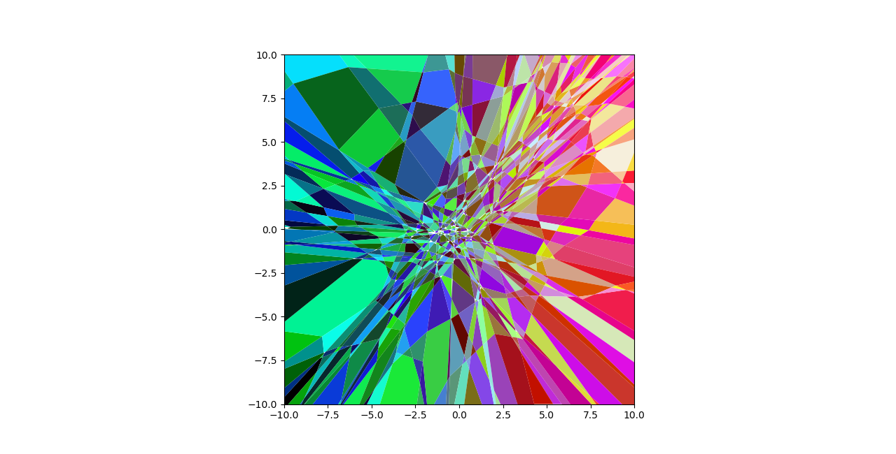

# I.) Introduction to Activation Regions of Piece-wise Linear Neural Networks

Brief exposition to the complexity of activation regions for deep ReLu networks. An activation region is simply a subset of the networks input space (possibly empty) which achieves a particular binary configuration of the neurons. See [Relu_Activation_Region_Complexity.pdf](Relu_Activation_Region_Complexity.pdf) to learn about the complexity scaling of activation regions of ReLu networks.

## Activation Regions Example:

# II.) Analyzing Rich Cells in Random Arrangement of Hyperplanes

See [Polytope_core.pdf](Polytope_core.pdf) for the beginning of an analysis of the distribution of polytope facet complexity within a random hyperplane arrangement. The notion of the Core of a polytope is introduced as a new analysis tool. With this notion formalized, hopefully it can be used to show that the proportion of rich cells in a random hyperplane arrangement is low.

# Example of a clean vertex cut:

NOTE: this repo is a clone of [repo](https://gitlab.inf.ethz.ch/gaertner/geometry-of-ml)

